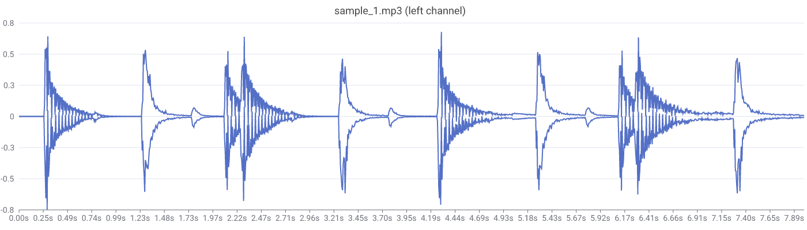
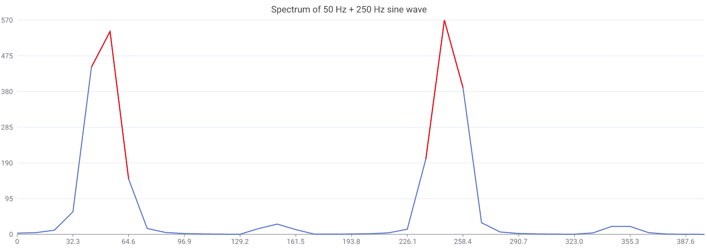
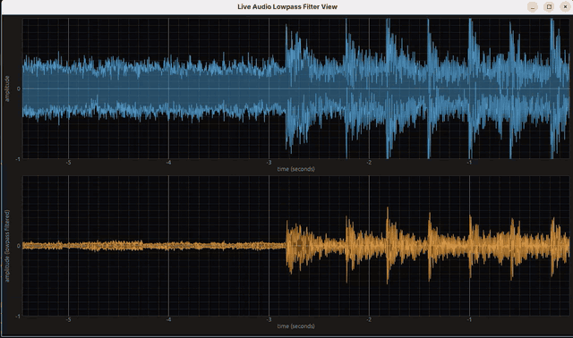
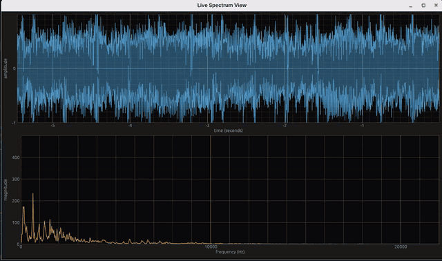

# Rust library: audio-visualizer

Debug audio data visually. This library targets developers who work on audio
algorithms and want to quickly check that samples, filters, or spectra look
as expected. It is not intended for polished end-user visualizations.

All functionality works on mono `f32` samples, typically amplitudes in
`[-1.0, 1.0]`. Interleaved stereo data can be split with
`deinterleave_stereo()`.

## Covered Functionality

- **static waveform** → PNG file or SVG string, with axes and time labels;
  samples are reduced to a min/max envelope per pixel, so peaks stay visible
- **static spectrum** → PNG file or SVG string, with optional highlighting
  of expected peaks (pairs well with the
  [spectrum-analyzer](https://crates.io/crates/spectrum-analyzer) crate)
- **live visualization**: records audio from an input device and displays
  the real-time waveform together with a custom transformation (lowpass
  filter, spectrum, signal power, ...) in a GUI window
  ([egui](https://crates.io/crates/egui)); cross-platform
  (Windows/WASAPI, Linux/ALSA, macOS/coreaudio)

## (Code) Examples

There are several runnable examples in the `examples/` directory.

### Static waveform

```rust
use audio_visualizer::waveform::Waveform;

Waveform::new(&samples)
    .sample_rate(44100.0)
    .title("sample_1.mp3 (left channel)")
    .write_png("waveform.png")?;
```



### Static spectrum

```rust
use audio_visualizer::spectrum::Spectrum;

// spectrum: &[(f32, f32)] with (frequency in Hz, magnitude) pairs,
// e.g. computed with the spectrum-analyzer crate
Spectrum::new(&spectrum)
    .highlight(50.0)
    .highlight(250.0)
    .write_png("spectrum.png")?;
```



### Live visualization

```rust
use audio_visualizer::live::{LiveVisualizer, Transform};
use lowpass_filter::lowpass_filter_slice;

LiveVisualizer::new(Transform::waveform(|samples, sample_rate| {
    let mut samples = samples.to_vec();
    lowpass_filter_slice(&mut samples, sample_rate, 80.0);
    samples
}))
.title("Live Audio Lowpass Filter View")
.open()?;
```

The GIFs below were recorded with the previous minifb-based UI; the current
egui-based UI shows the same content with nicer axes.

#### Real-time audio + lowpass filter (6.9MB GIF)

 \
On the top you see the original waveform of the song Holiday by Green Day.
On the bottom you see the data after a lowpass filter was applied. The beats
are visible.

#### Real-time audio + frequency spectrum (5.4MB GIF)

 \
On the top you see the original waveform of the song Holiday by Green Day.
On the bottom you see the frequency spectrum of the latest 46ms of audio.
Frequencies <2000Hz are clearly present.

## MSRV

The MSRV is 1.95.0 stable.

## Troubleshooting

### Linux

- make sure to have these required packages installed:
  `sudo apt install libasound2-dev libxkbcommon-dev`
