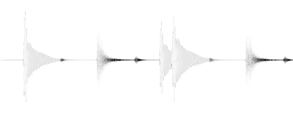

# Rust library: audio-visualizer

So far this library is rather basic and targets developers that develop audio algorithms. With this library you can
easily display your current audio data/waveform/spectrum and check if everything looks good/as expected.

## Covered Functionality

- **dynamic real-time audio**
    - [x] functionality to record audio and connect it with a GUI window
    - [x] side-by-side (top/btm) view of original waveform and custom view (e.g. spectrum or lowpass filter)
    - [x] cross-platform (Windows with WASAPI, Linux with ALSA, MacOS with coreaudio)
- **static waveform**
    - [x] very basic PNG output
    - [x] PNG output with basic axes/labels using https://crates.io/crates/plotters
    - [ ] TODO fancy static output (code contributions are welcome)

- **static spectrum**
    - [x] very basic PNG output with the option to highlight specific frequencies
      (definitely needs more work, code contributions are welcome)
    - [x] PNG output with basic axes/labels using https://crates.io/crates/plotters
      (definitely needs more work, code contributions are welcome)
    - [ ] TODO fancy static output (code contributions are welcome)

## (Code) Examples
There are several examples in the `examples/` directory. Below, you can see some visualization examples.

### Real-time audio + lowpass filter (6.9MB GIF)
 \
On the top you see the original waveform of the song Holiday by Green Day. On the bottom you see the data after a
lowpass filter was applied. The beats are visible.

### Real-time audio + frequency spectrum (5.4MB GIF)
 \
On the top you see the original waveform of the song Holiday by Green Day. On the bottom you see
the frequency spectrum of the latest 46ms of audio. Frequencies <2000Hz are clearly present.

### Example of a static waveform

### Example of a static spectrum

")

## MSRV
The MSRV is 1.56.1 stable.

## Troubleshooting
### Linux
- make sure to have these required packages installed: `sudo apt install libasound2-dev libxkbcommon-dev`
